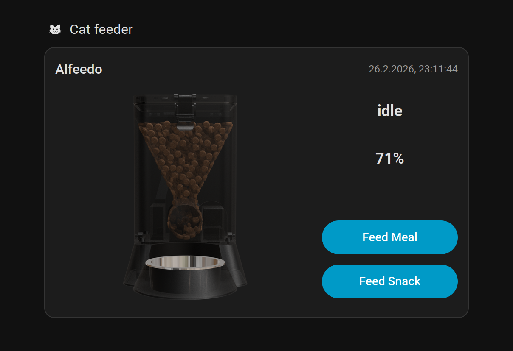
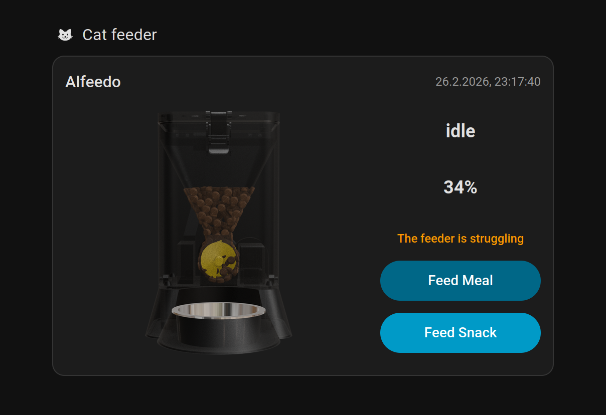

# Alfeedo 🐈‍⬛

**Alfeedo** is a 100% local Home Assistant integration for your DIY ESP32-powered cat feeder. No cloud, no latency—just a happy, well-fed cat.

## 🚀 One-Click Install

If you have HACS installed, click the button below to add this repository automatically:

[](https://my.home-assistant.io/redirect/hacs_repository/?owner=mzanetti&repository=ha-alfeedo&category=integration)

---

## ✨ Features
- **Local Control:** Communicates directly with your Alfeedo via HTTP/JSON.
- **Feeder Status:** Fill level, feeder status and control.
- **Custom UI Card:** Includes a purpose-built dashboard card.
- **Config Flow:** Auto detects Alfeedo in your network.

## 📸 Screenshots
| Alfeedo card | Jam detection alert |
| :--- | :--- |
|  |  |

## 🛠 Installation

### Via HACS (Recommended)
1. Open **HACS** in your Home Assistant instance.
2. Click the three dots in the top right corner and select **Custom repositories**.
3. Paste `https://github.com/mzanetti/ha-alfeedo` and select **Integration** as the category.
4. Click **Add**, then find **Alfeedo** in the list and click **Download**.
5. **Restart Home Assistant.**

### Manual Installation
1. Download the `latest release`.
2. Copy the `custom_components/alfeedo` directory into your Home Assistant `/config/custom_components/` folder.
3. **Restart Home Assistant.**

## ⚙️ Configuration
1. Navigate to **Settings** > **Devices & Services**.
2. Click **Add Integration** in the bottom right.
3. Search for **Alfeedo** and follow the prompts to enter your feeder's IP address.

## 🎨 Using the Custom Card
The Alfeedo card is automatically registered. To add it:
1. Edit your Dashboard.
2. Click **Add Card** and search for **Alfeedo Feeder Card**.
3. Select your Alfeedo entity and save.

```yaml
type: custom:alfeedo-card
entity: sensor.alfeedo_status
